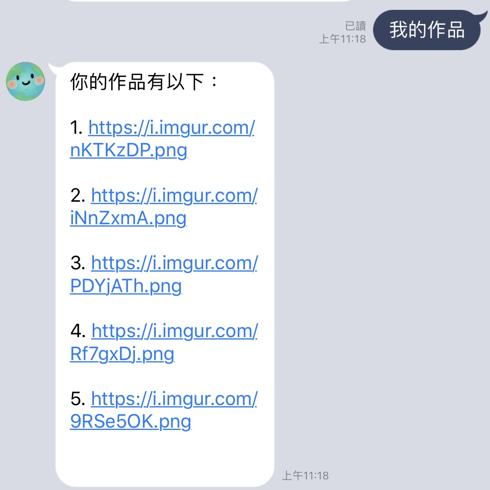
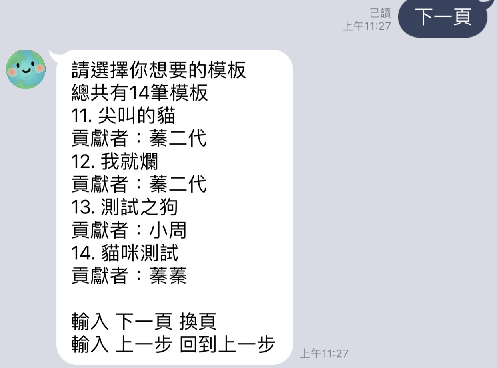

# TOC2020-梗圖製作機器人
## 理念
由於看到考研的學長，不好好讀書還再浪費時間製作一堆梗圖。可是我又認為生為梗圖死為梗圖的精神令人敬佩，於是為了魚與熊掌可以兼得，在讀書休息時利用梗圖機器人製作幾張梗圖既可以少浪費時間也可以帶給世人歡笑。

## Setup

### Prerequisite
* Python 3.6
* Line Developer and App
* HTTPS Server - Heroku
* Requiremet：
    * -i https://pypi.org/simple
    * certifi==2019.9.11
    * chardet==3.0.4
    * click==7.0
    * flask==1.0.2
    *    future==0.18.1
    *    idna==2.8
    *    itsdangerous==1.1.0
    *    jinja2==2.10.3
    *    line-bot-sdk==1.14.0
    *    markupsafe==1.1.1
    *    pygraphviz==1.5
    *    python-dotenv==0.10.3
    *    requests==2.22.0
    *    six==1.12.0
    *    transitions==0.6.9
    *    urllib3==1.25.6
    *    werkzeug==0.16.0
    *    psycopg2
    *    opencv-python
    *    numpy
    *    beautifulsoup4
    *    imgurpython
    *    Pillow

#### Install Dependency
```sh
pip3 install -r requirement.txt
```

* pygraphviz (For visualizing Finite State Machine)
    * [Setup pygraphviz on Ubuntu](http://www.jianshu.com/p/a3da7ecc5303)


#### Secret Data
You should generate a `.env` file to set Environment Variables refer to our `.env.sample`.
* Line：
    * LINE_CHANNEL_SECRET
    * LINE_CHANNEL_ACCESS_TOKEN
* Imgur
    * client_id
    * client_secret
    * access_token
    * refresh_token
* dbpassword
    * password for database
    * set information of database in fsm.py

All environment variable **MUST** be set to proper values.
Otherwise, you might not be able to run your code.

#### Run Locally
You can either setup https server or using `ngrok` as a proxy.

#### a. Ngrok installation
* [ macOS, Windows, Linux](https://ngrok.com/download)

or you can use Homebrew (MAC)
```sh
brew cask install ngrok
```

**`ngrok` would be used in the following instruction**

```sh
ngrok http 8000
```

After that, `ngrok` would generate a https URL.
and set https URL to webhook url in line developer
PORT 8000 also need to set in `.env.sample`

#### Run the sever

```sh
python3 app.py
```


## Finite State Machine


## Usage Demo
1. 最一開始的state是 `user`.
2. 你可以藉由輸入`你會做什麼`來進入以下畫面

3. 按下`讓我看看你的fsm圖`或者輸入`fsm`以得到fsm圖

4. 按下`來點梗圖`來觀看各種圖片

5. 按下`我的作品`可以觀看自己的貢獻(上傳)紀錄

6. 這裡示範點進第一個網址，並看到以下畫面

7. 按下`網路熱門`可觀看藉由網路爬蟲抓下來網友製作的熱門梗圖

8. 按下`再來一張`可再次回傳不一樣的熱門圖片

9. 按下`其他人上傳了什麼`可觀看使用此line-bot之其他使用者所上傳的圖片

10. 按下`回到主畫面`以回到主畫面並通知

11. 按下`我要貢獻`進入貢獻圖片state，並顯示後端資料庫之image list

12. 輸入`下一頁`得到下十筆之image list

13. 輸入`模板編號`(這裡示範輸入"1")得到第一個模板圖片

14. 根據系統提示輸入對應文字(這裡有3個字，所以示範輸入：高雄市 總統 韓國瑜)

15. 可以選擇`是否`來決定要不要上傳(這裡先示範選擇No)

16. 點選`修改文字`可回到填寫文字的state,並重新填寫文字

17. 點選`修改字體顏色`可修改顏色（這裡示範輸入`255 0 0`爲紅色）

18. 點選`修改字體大小`可修改文字大小（這裡示範輸入`40`）

19. 點選`修改字體位置`可變更字體位置（示範輸入`x 加 50 y 加 0`）

20. 點選`修改模板`可重新選取模板(這裡重新選取YesNo_Drake)

21. 可以選擇`是否`來決定要不要上傳(這裡示範選擇Yes)，會顯示上傳後的url連結

22. 上傳完成後也可以在`我的作品`中看到剛剛新增的選項

23. 也一樣能藉由網址點進去看到成品

24. 在主畫面可以選擇`模板增加`來貢獻模板，並須先輸入使用者暱稱

25. 使用者要先傳送原本作為樣板的圖，且還要上傳另一張給其他使用者看的圖

26. 接著輸入你設定的資料(名字 文字數量 x1 y1 x2 y2 ...)
    這裡使用(貓咪測試 1 150 500)

27. 可以在我要貢獻的image list頁面看到剛剛增加的貓咪模板



## 部屬
Setting to deploy webhooks on Heroku.
* Buildpack：
    * heroku/python
    * https://github.com/heroku/heroku-buildpack-apt
    * https://buildpackregistry.s3.amazonaws.com/buildpacks/herokucommunity/apt.tgz
    * https://github.com/weibeld/heroku-buildpack-graphviz
        * 因為助教提供的buildpack中graphviz版本太低，原先支援的圖片格式不多，所以自己新增這份buildpack，用以在傳送fsm圖
* Config Vars：
    * 

## 其他外部設置
* 圖片上傳
    * 
    * imgur api使用
    
    * 用以上傳使用者圖片，及記錄使用者上傳網址

* 資料庫整理
    * 
    * 直接利用Heroku的DB ，利用Admin4連接資料庫進行debug
    * psycopg2用來在`app.py`中連接資料庫新增刪除資料
    * image_list(user upload)參考
    * image_template(模板資訊)參考
* 影像處理
    * 
    * 利用opencv來進行文字加註，url轉image。
## 遇到的問題
* **Multiple User：**
    * Multiple User 知道一個user一個machine的原理 其實這樣實現multiple user 就可以了，所以就是判斷user_id去決定是否要建置新的machine或者利用這個user_id原有的machine
    * 
    * 

* **利用加字進去圖片中，中文會出現亂碼：**
    * 因為heroku上沒有支援的字體可以讀取，所以要自己下載字體並創立`.font`的資料夾中，這裡使用`simsun.ttc`來進行字串加入
* **使用format出現tuple index out of range：**
    * tuple index out of range意為元組指數超過範圍。在這裡format裡面的引數和前面的槽是一一對應的，因此當槽的個數大於引數時就會出現報錯。解決方法如下圖(網路上提供的解法)：
 
* **在heroku上利用要傳送fsm圖給自己時，一直出現以下狀況：**
    * 
    試過很多網路上的解法都不行，有人提出可能是graphviz版本太低不支援png，利用heroku上的bash跑dot-c、dot-v就可看到device中沒有png
    於是試著在heroku部屬更高版本的graphviz(原本還有助教提供的graphviz，所以只是更新)：
    `heroku buildpacks:set https://github.com/weibeld/heroku-buildpack-graphviz`
* **因為資料庫中存的是圖片url，要從url轉成opencv的img格式：**
    * 在網路上找到`url_image.py`
    * 
    將圖片載下來後藉由np.asarray讀取圖片並decode成cvimage的格式。
## Reviewed And Published：
* 歷史的演進：由於一個免費的API有傳送訊息上限，在測試時已經爆了2個，現在使用第3個
  
* Heroku 頁面
    
## END
